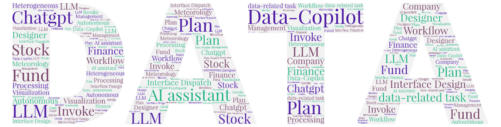
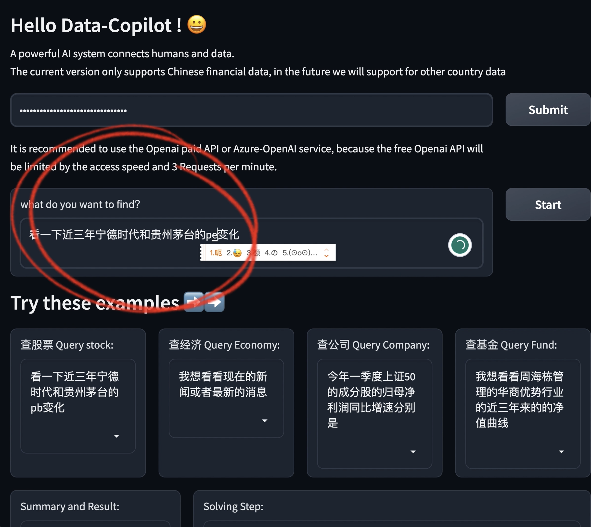

<div align="center">



# Data-Copilot: Bridging Billions of Data and Humans with Autonomous Workflow

<a href="https://arxiv.org/abs/2306.07209"></a>
<a href="https://openreview.net/forum?id=iUEBnQyfWE"></a>
<a href="https://huggingface.co/spaces/zwq2018/Data-Copilot"></a>
<a href="https://zhuanlan.zhihu.com/p/636906119"></a>
<a href="./LICENSE"></a>

**An LLM-based system that connects massive data with human requests:<br>it autonomously manages, processes, analyzes, predicts and visualizes data.**

</div>

## 🔥 News

- **2024.05**: Data-Copilot was presented as an **Oral** at the ICLR 2024 [Workshop on Large Language Models for Agents](https://openreview.net/forum?id=iUEBnQyfWE).
- **2023.06**: We released the [paper](https://arxiv.org/abs/2306.07209), the code and an [online demo](https://huggingface.co/spaces/zwq2018/Data-Copilot).

## 📖 Overview

Data-Copilot is an LLM-based system that helps you address data-related tasks. It connects data sources from different domains with diverse user needs, and can autonomously manage, process, analyze, predict and visualize data. When a request is received, it transforms raw data into the informative results that best match the user's intent.

<p align="center">
  
</p>

- ⭐ **Designer**: Data-Copilot independently designs versatile interface tools with different functions through self-request and iterative refinement.
- ⭐ **Dispatcher**: Data-Copilot invokes the corresponding interfaces sequentially or in parallel, and transforms raw data from heterogeneous sources into graphics, tables and text, without human assistance.

This repository releases Data-Copilot for the Chinese financial market: stocks, funds, economic data, company financial data and live news.

> **Paper:** [Data-Copilot: Bridging Billions of Data and Humans with Autonomous Workflow](https://arxiv.org/abs/2306.07209)<br>
> Wenqi Zhang, Yongliang Shen, Zeqi Tan, Guiyang Hou, Weiming Lu, Yueting Zhuang

## 🎬 Demo

Watch the [demo video](https://zhuanlan.zhihu.com/p/636906119). Data-Copilot queries and predicts data autonomously:

<p align="center">
  
</p>

Supported models and data sources:

| Model | CHN Stock | CHN Fund | CHN Economic data | CHN Financial data |
|:--|:--:|:--:|:--:|:--:|
| OpenAI GPT-3.5 | ✓ | ✓ | ✓ | ✓ |
| Azure GPT-3.5 | ✓ | ✓ | ✓ | ✓ |
| Qwen-72B-Chat | ✓ | ✓ | ✓ | ✓ |

Data-Copilot was built on GPT-3.5, whose input was limited to 4k tokens at the time, so this release covers Chinese stocks, funds and economic data. Data from foreign financial markets may be supported in the future.

## 🚀 Quick Start

### 1. Install

Python 3.8–3.10 is required (tested with Python 3.9 and 3.10).

```bash
git clone https://github.com/ZJU-OmniAI/Data-Copilot.git
cd Data-Copilot
conda create -n data-copilot python=3.10 -y
conda activate data-copilot
pip install -r requirements.txt
```

### 2. Set your keys

Data-Copilot reads its keys from environment variables:

| Variable | Needed for | Get it from |
|:--|:--|:--|
| `TUSHARE_TOKEN` | all financial data | [Tushare](https://tushare.pro/) |
| `OPENAI_KEY` | GPT in `main.py` | [OpenAI](https://platform.openai.com/) |
| `DASHSCOPE_API_KEY` | Qwen in `main.py` | [Alibaba Cloud Bailian](https://bailian.console.aliyun.com/) |

```bash
export TUSHARE_TOKEN="your-tushare-token"
export OPENAI_KEY="sk-..."
```

Some Tushare interfaces used here are only open to accounts with enough credits (积分). In the web demo, you enter the OpenAI or Azure-OpenAI key on the page instead.

### 3. Run from the command line

```bash
python main.py
```

`main.py` answers the example request at the end of the file. To ask something else, edit `instruction`. To switch the LLM, set `model` to `"gpt"` or `"qwen-chat-72b"`.

The model versions are set in `lab_gpt4_call.py` (`gpt-3.5-turbo`) and `lab_llms_call.py` (`qwen-72b-chat`). If your provider no longer offers them, change the model names there.

### 4. Run the web demo

```bash
python app.py
```

Then open <http://127.0.0.1:7860>. An online version of this demo is on [Hugging Face Spaces](https://huggingface.co/spaces/zwq2018/Data-Copilot).

1. Enter your OpenAI key and click **OK**. For Azure-OpenAI, enter the key, the API base and the deployment name (engine) instead. A paid OpenAI plan is recommended: with the rate limits of a free plan, the demo is very slow.
2. Type your request, or pick one from the example boxes.
3. Click **Start**. The **Solving Step** box shows the intermediate workflow. The final answer appears as text (**Summary and Result**), a chart and a table.

<p align="center">
  
</p>

> [!NOTE]
> Stock names are matched against a local copy of the stock list saved on 2023-04-21 (`data/`). Stocks that were listed or renamed after that date are not found.

## 🗂️ Project Structure

```text
Data-Copilot
├── main.py                # the workflow: intent detection → task planning → tool calls → visualization → summary
├── app.py                 # Gradio web demo
├── tool.py                # interface tools: data acquisition, processing, prediction and visualization
├── lab_gpt4_call.py       # OpenAI and Azure-OpenAI calls
├── lab_llms_call.py       # Qwen (DashScope) and GLM calls
├── lab_llm_local_call.py  # local InternLM (optional; needs torch, transformers and modelscope)
├── prompt_lib/            # prompts and in-context demonstrations for each stage and task
├── tool_lib/              # interface descriptions shown to the LLM, one file per task
├── create_tool/           # atomic Tushare API descriptions used for interface design
├── data/                  # local lists: A-share stocks, funds, SW2021 industries
├── fonts/                 # SimHei font for Chinese text in charts
├── output/                # tables saved by print_save_table
├── docs/flowchart.md      # flowchart of main.py
└── assets/                # figures used in this README
```

`tool.py` and `tool_lib/` contain the interface tools obtained in the first phase (interface design). `prompt_lib/` contains the prompts and in-context demonstrations.

## ⚙️ How It Works

`main.py` handles a request in five stages:

1. **Intent detection**: rewrites the request into a precise instruction with concrete dates and indicators.
2. **Task planning**: splits the instruction into a data task (`stock_task`, `fund_task` or `economic_task`) and a `visualization_task`.
3. **Tool calls**: the LLM plans a workflow of interface calls for the data task (step by step, in parallel, or in a loop), and Data-Copilot runs it.
4. **Visualization**: a second workflow draws charts or prints tables from the results.
5. **Summary**: the LLM explains the plan, the tools it used and the result.

A [flowchart of `main.py`](./docs/flowchart.md) is also available.

## 🍺 Cases

**Daily net inflow and cumulative inflow of northbound capital this year**

<p align="center">
  
</p>

<details>
<summary><b>China's quarterly GDP growth over the past ten years</b></summary>
<br>
<p align="center">
  
</p>
</details>

<details>
<summary><b>A loop workflow: Q1 net profit growth of every SSE 50 constituent</b></summary>
<br>
<p align="center">
  
</p>
</details>

## 📝 Citation

If you find this work useful, please cite:

```bibtex
@article{zhang2023data,
  title={Data-Copilot: Bridging Billions of Data and Humans with Autonomous Workflow},
  author={Zhang, Wenqi and Shen, Yongliang and Tan, Zeqi and Hou, Guiyang and Lu, Weiming and Zhuang, Yueting},
  journal={arXiv preprint arXiv:2306.07209},
  year={2023}
}
```

## 📬 Contact

If you have any questions, please open an issue or email zhangwenqi@zju.edu.cn.

## 🙏 Acknowledgement

- [ChatGPT](https://platform.openai.com/)
- [Tushare](https://tushare.pro/)
- [Qwen](https://bailian.console.aliyun.com/)
